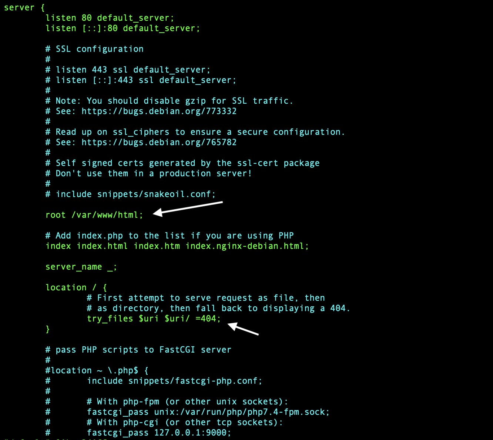
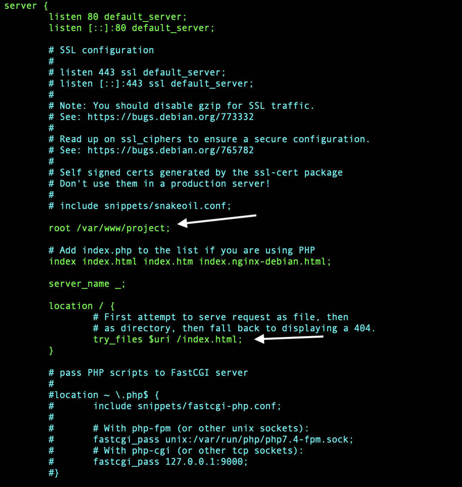

# *NGINX*

---

### *1. Create your own package for nginx*
- #### The index package for nginx is `/var/www/html`
- #### We need to create aur own package into `/var/www`
```
sudo mkdir /var/www/project
```
---

### *2. Copy all files from build to `project` package*
```
sudo cp -r <path>/build/* /var/www/project/
```
--

### *3. Change nginx configuration*
```
sudo vim /etc/nginx/sites-available/default
```
- #### *Change them like this:*





- After changing just restart nginx and website ready to work!
```
systemctl restart nginx
```
